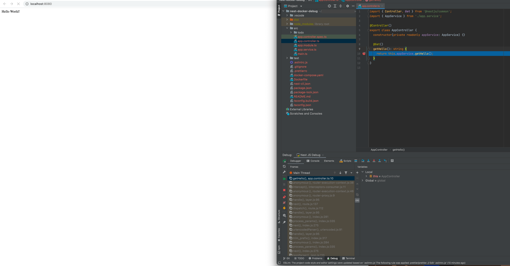

# Introduction

This repository contains the configuration needed to debug a NEST JS application in docker container. The set up provied
here can be used to debug in 
- VS Code 
- Webstorm

### To start the application: 

`docker-compose up`

### To rebuild and start:

`docker-compose up --build`

### Debug configuration:

#### VS Code:

The configuration can be found inside .vscode. if you remote folder name is different then 
add that to remoteRoot in the launch.json file. 

#### Webstorm:

- In Webstorm, click Run → Edit Configurations
- Click + to create a new configuration
- Check "Reconnect Automatically"  (don't forget this one!)
- Choose "Attach to Node.js/Chrome"
    - Host: localhost
    - Port: 9229
    - Attach to: "Chrome or Node.js > 6.3 started with --inspect"
    - Near the bottom of the box, ensure that "Activate tool window" is already checked

### Demo of debug working in both VS Code and Webstorm

